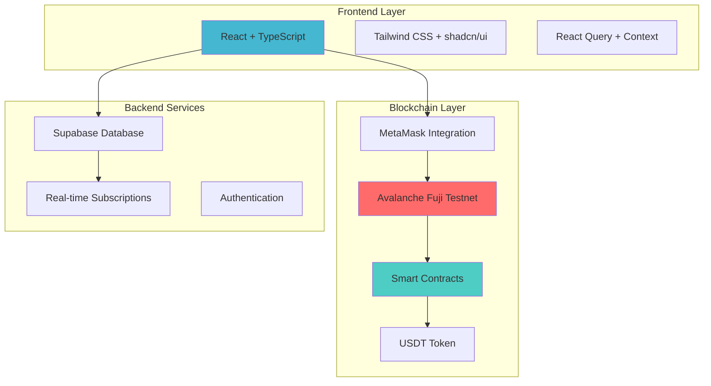
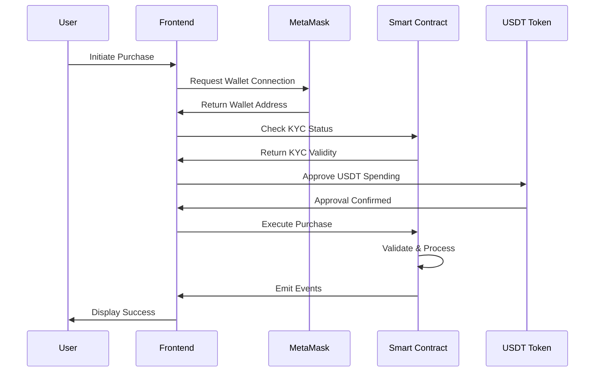
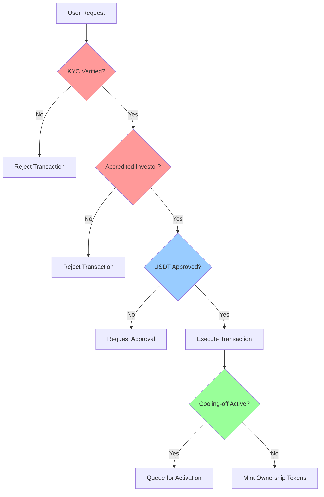
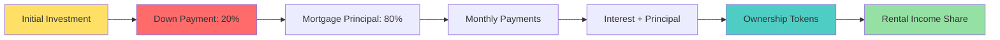
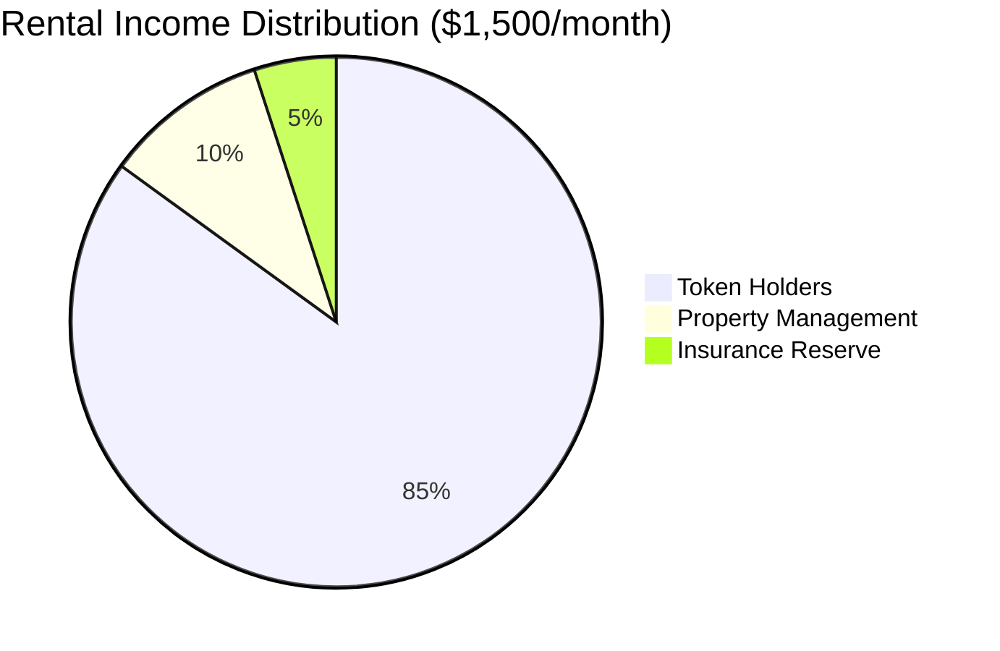
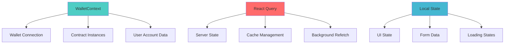
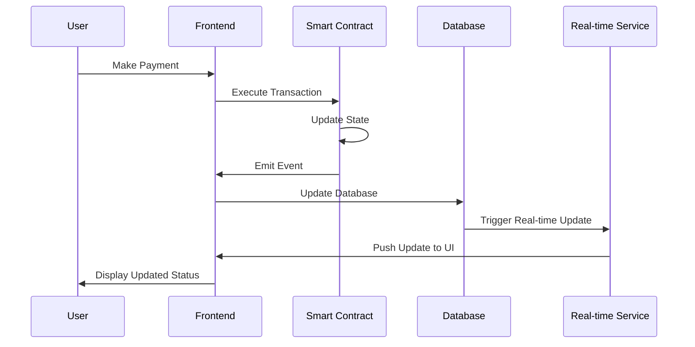
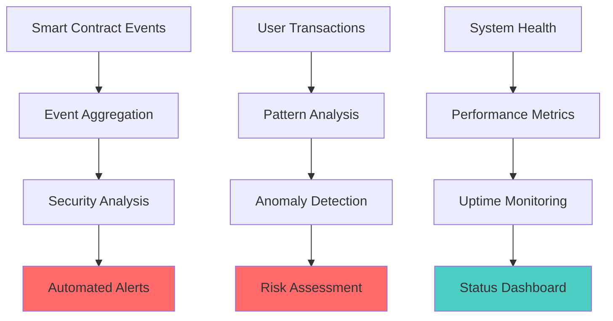
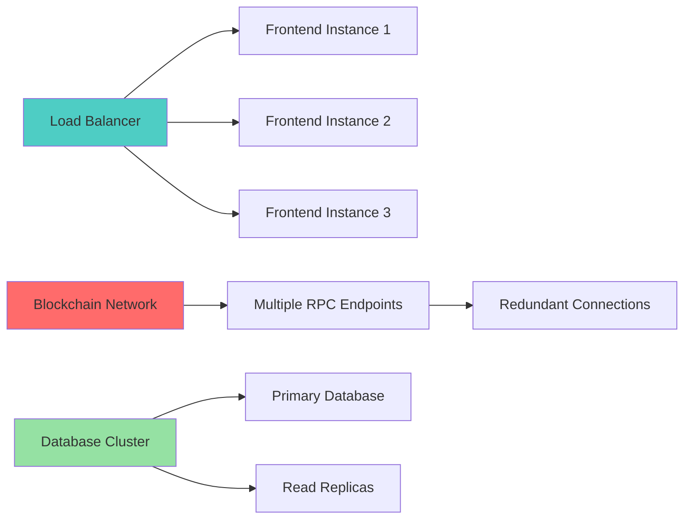

# Technical Architecture - Mazunte Real Estate Platform

## 🏗️ System Overview

The Mazunte platform is a full-stack blockchain application enabling fractional real estate investment through smart contracts. Built with modern web technologies and production-grade security.



## 📊 Smart Contract Architecture

### Contract Hierarchy
```solidity
MazunteMortgageV2
├── ERC1155 (Fractional Ownership Tokens)
├── Ownable (Admin Controls)
├── ReentrancyGuard (Security)
├── Pausable (Emergency Stop)
└── IERC20 (USDT Integration)
```

### Core Contract Functions


## 🔐 Security Architecture

### Multi-layered Security Model



### Access Control Matrix

| Function | Public | KYC Required | Accredited Required | Admin Only |
|----------|--------|--------------|-------------------|------------|
| `purchaseProperty()` | ❌ | ✅ | ✅ | ❌ |
| `makePayment()` | ❌ | ✅ | ❌ | ❌ |
| `claimRentalIncome()` | ❌ | ✅ | ❌ | ❌ |
| `distributeRentalIncome()` | ❌ | ❌ | ❌ | ✅ |
| `forecloseMortgage()` | ❌ | ❌ | ❌ | ✅ |
| `emergencyPause()` | ❌ | ❌ | ❌ | ✅ |
| `verifyKYC()` | ❌ | ❌ | ❌ | ✅ |

## 💰 Financial Architecture

### Investment Flow


### Payment Schedule Calculation
```javascript
// Compound Interest Formula Implementation
function calculateMonthlyPayment(principal) {
    const monthlyRate = (ANNUAL_RATE_BPS * PRECISION) / (12 * BPS);
    const numberOfPayments = LOAN_TERM_MONTHS;
    
    const numerator = principal * monthlyRate;
    const denominator = PRECISION - 
        ((PRECISION * PRECISION) / 
         ((PRECISION + monthlyRate) ** numberOfPayments));
    
    return numerator / (denominator / PRECISION);
}
```

### Rental Income Distribution


## 🏢 Database Schema

### Supabase Tables
```sql
-- Properties table
CREATE TABLE properties (
    id BIGSERIAL PRIMARY KEY,
    name TEXT NOT NULL,
    address TEXT NOT NULL,
    price NUMERIC NOT NULL,
    created_at TIMESTAMP WITH TIME ZONE DEFAULT NOW()
);

-- Enable RLS
ALTER TABLE properties ENABLE ROW LEVEL SECURITY;

-- Public access policy
CREATE POLICY "Allow all access" ON properties FOR ALL USING (true);
```

## 🔧 Frontend Architecture

### Component Hierarchy
```
App.tsx
├── WalletProvider (Context)
│   ├── QueryClientProvider
│   └── BrowserRouter
│       ├── Index (Landing Page)
│       ├── InvestorPortal
│       │   ├── FeaturedProperties
│       │   ├── InvestmentCalculator
│       │   └── PropertyPurchaseModal
│       ├── Portfolio
│       │   ├── InvestorMortgageDashboard
│       │   └── PropertyCard
│       └── SmartContractTest
│           ├── WalletConnection
│           ├── ContractInteraction
│           └── TestingInterface
```

### State Management Flow


## 🌐 Network Architecture

### Avalanche Integration
```mermaid
graph TB
    subgraph "Avalanche Fuji Testnet"
        A[Primary Network]
        B[C-Chain (EVM Compatible)]
        C[Smart Contracts]
        D[USDT Token Contract]
    end
    
    subgraph "User Interface"
        E[MetaMask Wallet]
        F[Web3 Provider]
        G[ethers.js]
    end
    
    E --> F
    F --> G
    G --> B
    B --> C
    B --> D
    
    style B fill:#ff6b6b
    style C fill:#4ecdc4
```

### Network Configuration
```javascript
const AVALANCHE_FUJI = {
    chainId: '0xA869', // 43113 in hex
    chainName: 'Avalanche Fuji Testnet',
    nativeCurrency: {
        name: 'AVAX',
        symbol: 'AVAX',
        decimals: 18
    },
    rpcUrls: ['https://api.avax-test.network/ext/bc/C/rpc'],
    blockExplorerUrls: ['https://testnet.snowtrace.io/']
};
```

## 📱 Responsive Design Architecture

### Breakpoint System
```css
/* Tailwind CSS Breakpoints */
sm: '640px',   /* Mobile landscape */
md: '768px',   /* Tablet */
lg: '1024px',  /* Desktop */
xl: '1280px',  /* Large desktop */
2xl: '1536px'  /* Extra large */
```

### Mobile-First Component Design
```jsx
// Responsive PropertyCard example
<Card className="w-full max-w-sm mx-auto md:max-w-md lg:max-w-lg">
    <div className="aspect-video md:aspect-[4/3] lg:aspect-video">
        
    </div>
    <CardContent className="p-4 md:p-6">
        <h3 className="text-lg md:text-xl lg:text-2xl font-semibold">
            {property.name}
        </h3>
    </CardContent>
</Card>
```

## 🔄 Data Flow Architecture

### Real-time Updates


## 🚀 Deployment Architecture

### Development Environment
```bash
# Local Development Stack
React Development Server (Port 5173)
├── Hot Module Replacement
├── TypeScript Compilation
├── Tailwind CSS Processing
└── Vite Build System

MetaMask Extension
├── Avalanche Fuji Network
├── Test AVAX Tokens
└── Smart Contract Interaction
```

### Production Environment
```bash
# Production Deployment
Lovable Platform
├── CDN Distribution
├── HTTPS Enforcement
├── Build Optimization
└── Custom Domain Support

Avalanche Mainnet (Future)
├── Production Smart Contracts
├── Real USDT Integration
└── Enhanced Security Features
```

## 📊 Performance Optimization

### Frontend Optimization
```javascript
// Code Splitting
const Portfolio = lazy(() => import('./pages/Portfolio'));
const InvestorPortal = lazy(() => import('./pages/InvestorPortal'));

// Memoization for expensive calculations
const monthlyPayment = useMemo(() => 
    calculateMonthlyPayment(principal), [principal]
);

// React Query for efficient data fetching
const { data: properties } = useQuery({
    queryKey: ['properties'],
    queryFn: fetchProperties,
    staleTime: 5 * 60 * 1000, // 5 minutes
});
```

### Smart Contract Optimization
```solidity
// Gas-efficient storage patterns
struct Mortgage {
    uint128 principal;      // Packed to single slot
    uint128 monthlyPayment; // Packed to single slot
    uint32 startDate;       // Packed with next field
    uint32 nextPaymentDue;  // Packed with previous field
    bool isActive;          // Single bit
    bool coolingOffActive;  // Single bit
}

// Batch operations for efficiency
function multicall(bytes[] calldata data) 
    external returns (bytes[] memory results);
```

## 🛡️ Security Monitoring

### Event Logging
```solidity
// Comprehensive event emission
event MortgageCreated(
    address indexed buyer,
    uint256 amount,
    uint256 indexed mortgageId,
    uint256 timestamp
);

event PaymentMade(
    address indexed buyer,
    uint256 amount,
    uint256 remainingBalance,
    uint256 timestamp
);

event SecurityAlert(
    address indexed account,
    string alertType,
    uint256 timestamp
);
```

### Monitoring Dashboard


## 📈 Scalability Architecture

### Horizontal Scaling


### Future Scaling Considerations
1. **Layer 2 Integration**: Polygon or Arbitrum for lower fees
2. **Database Sharding**: Partition data across multiple databases
3. **CDN Integration**: Global content distribution
4. **Microservices**: Break down monolithic components
5. **Caching Layers**: Redis for frequently accessed data

---

*This architecture provides enterprise-grade scalability, security, and maintainability for institutional real estate investment.*