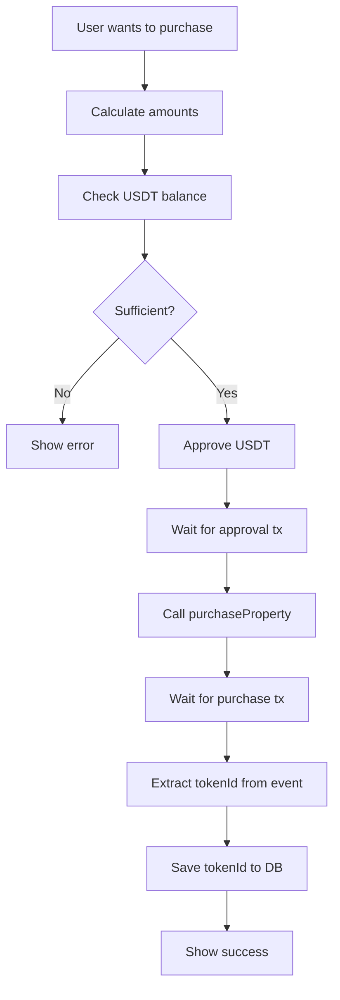

# Ancient Lending Protocol - Quick Reference

## 📍 Contract Addresses (Base Sepolia)

```typescript
const CONTRACTS = {
  AncientMortgage: "0xb48a5f86ffe36d3249acf6d97b14c2eac0dea6b5",
  AncientStakingPool: "0xac7378799cffd01f38a4e39fb5d91d60a0e62b33",
  MockUSDT: "0x82895d380f6df68d50e34d2ccc94bad1415a2b46",
};
```

## 🔢 Platform Constants

```typescript
DOWN_PAYMENT = 20%        // of property price
PLATFORM_FEE = 3%         // of property price
APR = 8%                  // annual percentage rate
TERM = 120 months         // 10 years
USDT_DECIMALS = 6         // NOT 18!
```

## 📝 Core Functions

### Purchase Property

```typescript
// 1. Calculate amounts
const propertyPrice = parseUSDT("250000.00");  // 250k USDT
const totalApproval = (propertyPrice * 23n) / 100n;  // 20% + 3%

// 2. Approve USDT
await usdt.approve(mortgageAddress, totalApproval);

// 3. Purchase (NO ETH VALUE!)
const tx = await mortgage.purchaseProperty(propertyPrice);
const receipt = await tx.wait();

// 4. Get tokenId from event
const event = receipt.logs.find(log => 
  mortgage.interface.parseLog(log)?.name === 'MortgageCreated'
);
const tokenId = mortgage.interface.parseLog(event).args.tokenId;
```

### Make Payment

```typescript
// 1. Get payment amount
const mortgageData = await mortgage.getMortgage(tokenId);
const monthlyPayment = mortgageData.monthlyPayment;

// 2. Approve USDT
await usdt.approve(mortgageAddress, monthlyPayment);

// 3. Pay (NO ETH VALUE!)
await mortgage.makePayment(tokenId);
```

### Read Mortgage Data

```typescript
const data = await mortgage.getMortgage(tokenId);
// Returns: [propertyOwner, propertyPrice, downPayment, loanAmount, 
//           monthlyPayment, remainingBalance, startTime, termMonths, 
//           paymentsMade, isActive]
```

## 🔄 USDT Helpers

```typescript
// Convert USD string to USDT bigint (6 decimals)
parseUSDT("250000.00") → 250000000000n

// Convert USDT bigint to USD string
formatUSDT(250000000000n) → "250000.000000"

// Calculate down payment (20%)
calculateDownPayment(propertyPrice) → downPayment

// Calculate platform fee (3%)
calculatePlatformFee(propertyPrice) → platformFee

// Calculate total needed for purchase (23%)
calculateTotalApproval(propertyPrice) → totalApproval
```

## ⚠️ Common Mistakes

```typescript
// ❌ WRONG - Sending ETH value
await mortgage.purchaseProperty(price, { value: ethers.parseEther("1") });
await mortgage.makePayment(tokenId, { value: payment });

// ✅ CORRECT - ERC20 approval only
await usdt.approve(mortgageAddress, amount);
await mortgage.purchaseProperty(price);
await mortgage.makePayment(tokenId);

// ❌ WRONG - Wrong decimals
const price = ethers.parseEther("250000");  // 18 decimals

// ✅ CORRECT - USDT decimals
const price = BigInt(250000) * BigInt(10**6);  // 6 decimals

// ❌ WRONG - Wrong function signature
await mortgage.purchaseProperty(propertyId, downPayment, termMonths, apr, sig);

// ✅ CORRECT - Single parameter
await mortgage.purchaseProperty(propertyPrice);

// ❌ WRONG - Wrong read function
await mortgage.getMortgageDetails(userAddress);

// ✅ CORRECT - Use tokenId
await mortgage.getMortgage(tokenId);
```

## 📊 UI Display Examples

```typescript
// Property purchase breakdown
const propertyPrice = parseUSDT("250000.00");
const breakdown = {
  propertyPrice: "250,000.00 USDT",
  downPayment: "50,000.00 USDT",      // 20%
  platformFee: "7,500.00 USDT",       // 3%
  totalDueNow: "57,500.00 USDT",      // 23%
  loanAmount: "192,500.00 USDT",      // 77%
  monthlyPayment: "~2,333.00 USDT",   // Calculated by contract
  term: "120 months (10 years)",
  apr: "8%"
};
```

## 🔍 Debugging

```typescript
// Check USDT balance
const balance = await usdt.balanceOf(userAddress);
console.log("USDT Balance:", formatUSDT(balance));

// Check USDT allowance
const allowance = await usdt.allowance(userAddress, mortgageAddress);
console.log("USDT Allowance:", formatUSDT(allowance));

// Check network
const network = await provider.getNetwork();
console.log("Network:", network.chainId); // Should be 84532

// Check mortgage exists
try {
  const data = await mortgage.getMortgage(tokenId);
  console.log("Mortgage found:", data);
} catch {
  console.log("Mortgage not found");
}
```

## 🎯 Transaction Flow



## 🗄️ Supabase Schema

```sql
-- Store contract addresses
CREATE TABLE contract_addresses (
  contract_name TEXT NOT NULL,
  network TEXT NOT NULL,
  address TEXT NOT NULL,
  UNIQUE(contract_name, network)
);

INSERT INTO contract_addresses VALUES
  ('AncientMortgage', 'base-sepolia', '0xb48a5f86ffe36d3249acf6d97b14c2eac0dea6b5'),
  ('MockUSDT', 'base-sepolia', '0x82895d380f6df68d50e34d2ccc94bad1415a2b46');

-- Store user mortgages
CREATE TABLE user_mortgages (
  user_id UUID,
  token_id BIGINT NOT NULL,
  property_price NUMERIC,
  contract_address TEXT,
  network TEXT DEFAULT 'base-sepolia',
  created_at TIMESTAMP DEFAULT NOW()
);
```

## 📦 Import Statements

```typescript
// ABIs
import { AncientMortgageABI, MockUSDTABI } from './abis';

// Addresses
import { deployments, ChainId } from './addresses';

// Types and helpers
import { 
  parseUSDT, 
  formatUSDT, 
  calculateDownPayment,
  calculatePlatformFee,
  calculateTotalApproval,
  Mortgage 
} from './types';

// Ethers
import { ethers } from 'ethers';
```

## 🔗 Useful Links

- [Base Sepolia Faucet](https://faucet.quicknode.com/base/sepolia)
- [Base Sepolia Explorer](https://sepolia.basescan.org)
- [AncientMortgage Contract](https://sepolia.basescan.org/address/0xb48a5f86ffe36d3249acf6d97b14c2eac0dea6b5)
- [MockUSDT Contract](https://sepolia.basescan.org/address/0x82895d380f6df68d50e34d2ccc94bad1415a2b46)

## 💡 Pro Tips

1. **Always approve before calling contract methods** - USDT needs approval for every purchase and payment
2. **Store tokenId after purchase** - You'll need it for all future operations
3. **Use 6 decimals for USDT** - Not 18 like ETH!
4. **Never send ETH value** - All payments are USDT via transferFrom
5. **Fail fast** - Don't fallback to wrong addresses, show clear errors
6. **Log everything** - Console log addresses, amounts, and transaction hashes
7. **Test on testnet** - Use Base Sepolia before production

